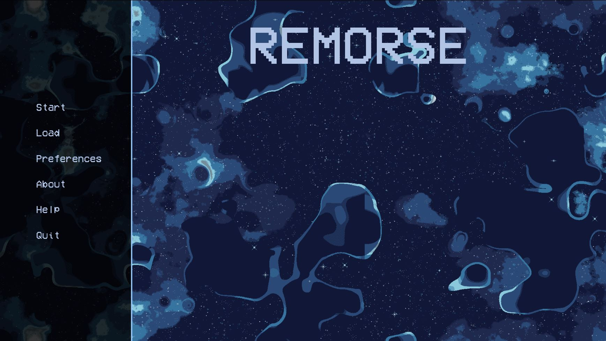
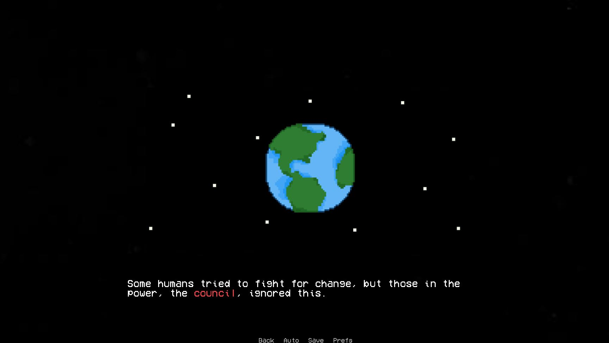
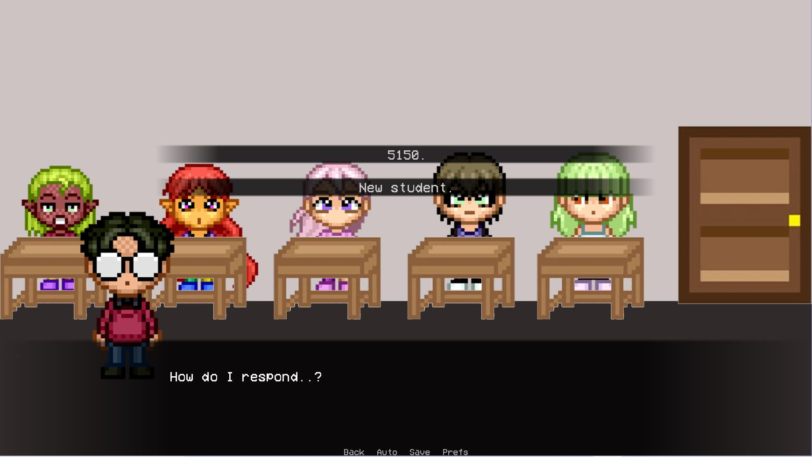
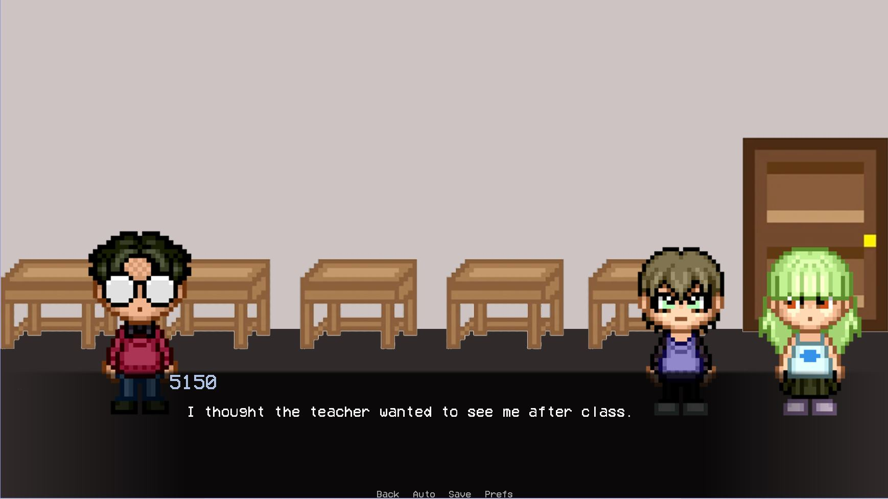

# REMORSE
A game idea based on a society living on a ship after the extinction of planet Earth: follow characters who have been altered by the effects of climate change and learn of the "true evil" the leaders hide. Backgrounds, sprites, game idea, and storyline are all original! :) 
(The plan is to have about seven/eight chapters of gameplay in total)
Indie-game made with Ren'Py: https://www.renpy.org/doc/html/

# Current UI for Chapter One:

